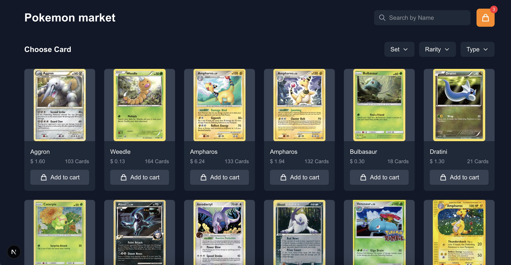

# Pokemon Card Market

A modern, responsive web application for browsing and purchasing Pokemon trading cards. Built with Next.js 15, React 19, TypeScript, and Tailwind CSS.



## Features

- Browse Pokemon cards with pagination
- Search cards by name
- Filter cards by type, rarity, and set
- Shopping cart functionality with persistent storage
- Responsive design for both desktop and mobile
- Detailed card information including pricing and availability

## Tech Stack

- **Framework**: Next.js 15 with App Router
- **Frontend**: React 19 with Hooks
- **Language**: TypeScript
- **Styling**: Tailwind CSS 4
- **HTTP Client**: Axios
- **Icons**: React Icons
- **Testing**: Jest and React Testing Library

## Getting Started

### Prerequisites

- Node.js 18.x or higher
- npm 9.x or higher

### Installation

1. Clone the repository:

```bash
git clone https://github.com/UKRx/pokemon-card-market.git
cd pokemon-card-market
```

# Install dependencies

npm install

# Run development server

npm run dev

# Build for production

npm run build

# Run production build

npm start

# Run tests

npm test
